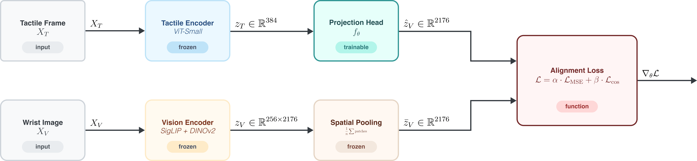
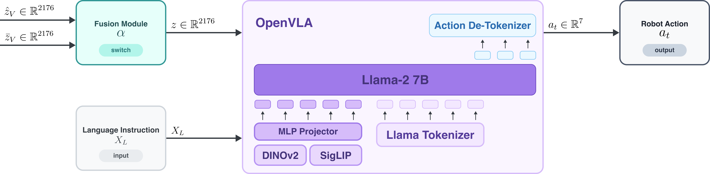

# Blind-VLA: Tactile-to-Visual Representation Learning for Vision-Language-Action Models

This repository contains the official research implementation accompanying the thesis project **"Blind-VLA"**. This framework addresses the vulnerability of autoregressive Vision-Language-Action (VLA) models to visual sensor degradation through targeted cross-modal alignment in the continuous latent hypersphere.

---

## 1. Abstract & Problem Formulation

State-of-the-art Vision-Language-Action (VLA) models, such as OpenVLA, exhibit remarkable open-vocabulary instruction-following capabilities in robotic manipulation. However, their policy generation is implicitly upper-bounded by the quality of the primary visual stream ($I$). In contact-rich manipulation tasks, factors such as camera occlusions, illumination failures, and motion blur introduce a severe single point of failure.

**Blind-VLA** introduces a parameter-efficient, cross-modal transfer mechanism that aligns high-resolution optical tactile representations (rendered via the DIGIT/TACTO framework) directly into the pre-trained latent space of a frozen 7B-parameter VLA backbone. By establishing a geometric and semantic bridge between tactile contact signatures ($X_T$) and visual token spaces ($z_V$), the system guarantees policy consistency ($\mathcal{L}_{\text{policy}}$) even under total visual blackout.

---

## 2. Core Methodology & Mathematical Framework

### 2.1 Latent Space Projection ($f_\theta$)
Rather than fine-tuning the autoregressive layers of the VLA, we employ a frozen configuration of the OpenVLA vision encoder (SigLIP-DINOv2) and the TVL tactile encoder (ViT-Small). We optimize a lightweight, residual MLP projection head:

$$f_\theta: \mathbb{R}^{384} \longrightarrow \mathbb{R}^{2176}$$

which maps the tactile embedding $z_T$ to a projected visual target $\hat{z}_V$, matching the dimensionality of the average-pooled visual patch tokens $\bar{z}_V$.

### 2.2 Hybrid Alignment Objective
The projection head is constrained during Phase 2 training by a hybrid objective anchoring both geometric magnitude and directional orientation, preventing representation collapse:

$$\mathcal{L}_{\text{total}} = \gamma \mathcal{L}_{\text{MSE}}\left(f_\theta(z_T), \bar{z}_V\right) + \delta \mathcal{L}_{\text{cos}}\left(f_\theta(z_T), \bar{z}_V\right)$$

where $\gamma = \delta = 1.0$, targeting an empirical out-of-distribution (OOD) cosine similarity threshold of $> 0.8$ on held-out YCB objects.

### 2.3 Dynamic Multimodal Fusion
At inference, visual and projected tactile embeddings are fused via a quality-aware gating factor $\alpha(I)$:

$$z = \alpha(I) z_V^{(T)} + (1 - \alpha(I)) E_{\text{vision}}(I)$$

This repository evaluates three progressive soft-gating architectures:
1. **Hard Binary Switch:** Threshold-driven cutoff based on raw image metrics.
2. **Heuristic Soft Gate:** Analytical image degradation scoring (Gaussian variance and blur kernel estimation).
3. **Learned Gate ($g_\phi$):** A shallow end-to-end network optimized directly via the downstream policy consistency loss.

---

## 3. Architecture & Data Flow

<table align="center" style="border: none; border-collapse: collapse;">
  <tr style="border: none;">
    <td align="center" style="border: none; padding: 10px; width: 50%; vertical-align: top;">
      
        <b>(a) Training Phase (Alignment)</b>
    </td>
    <td align="center" style="border: none; padding: 10px; width: 50%; vertical-align: top;">
      
        <b>(b) Inference Phase (Gating)</b>
    </td>
  </tr>
</table>

> **Figure 1:** Cross-modal alignment pipeline. **(a) Phase 2: Cross-Modal Latent Alignment (Training phase).** The tactile branch passes the optical tactile tensor $X_T$ through a frozen TVL ViT-Small encoder and a trainable residual MLP projection head $f_\theta$ to produce the projected visual target $\hat{z}_V$. The primary visual branch processes the wrist-camera image $X_V$ through the frozen OpenVLA SigLIP+DINOv2 vision backbone, followed by spatial average pooling to compute the target embedding $\bar{z}_V$. Both representations are aligned in the continuous latent space via a hybrid MSE and cosine similarity objective. **(b) Phase 3: Dynamic Gating & Policy Execution (Inference phase).** During inference under visual degradation or blackout, the dynamic gating mechanism bypasses or complements the corrupted visual stream using the aligned tactile embedding $\hat{z}_V$ to drive the frozen autoregressive Llama-2 7B policy network.

---

## 4. Experimental Setup & Reproducibility

To ensure strict numerical reproducibility across local and distributed environments, the experimental pipeline enforces deterministic physics, photorealistic rendering seeds, and fixed library configurations.

### 4.1 Cross-Modal Dataset Structure
The empirical validation of the latent alignment phase is sustained by a monolithic HDF5 dataset structured via `h5py`. The dataset spans a total of approximately 17,000 paired tactile-visual samples collected from 3,500 simulation episodes. To guarantee robust out-of-distribution (OOD) evaluation, the dataset is partitioned into a strict three-tier geometric hierarchy with non-overlapping object sets:

* **Tier 1 — Geometric Primitives (Debugging Baseline):** Comprises 3 idealised shapes (cube, cylinder, and sphere) totaling $\sim$2,000 samples ($\sim$50 MB). This tier is utilized exclusively to validate gradient stability, verify the hybrid objective functions, and confirm basic tactile feature capture.
* **Tier 2 — YCB Training Corpus (Core Optimization):** Comprises 8 distinct YCB objects selected to maximize geometric and topographic diversity of the local contact patch (curvatures, ridge profiles, sharp edges), yielding $\sim$12,000 samples ($\sim$300 MB). This tier constitutes the primary optimization corpus for the projection head $f_\theta$.
* **Tier 3 — Held-Out YCB Test Set (Zero-Shot Generalisation):** Comprises 3 novel YCB geometries completely isolated from the training distribution, containing $\sim$3,000 samples ($\sim$75 MB). This tier is reserved exclusively for zero-shot generalisation evaluation under the visual degradation curriculum.

### 4.2 Visual Degradation Curriculum
During the downstream joint policy training phase (Phase 3), the visual embedding stream is subjected to a synthetic degradation curriculum before being passed to the fusion module. Perturbation severity increases monotonically across training iterations according to five sequential stages:
1. **Clean:** Unmodified RGB camera input (baseline OpenVLA performance).
2. **Gaussian Noise:** Additive i.i.d. noise with progressively increasing variance.
3. **Motion Blur:** Uniform blur kernel with a monotonically increasing radius.
4. **Partial Occlusion:** Rectangular masking over a random crop of the image frame, simulating gripper self-occlusion during the grasp phase.
5. **Full Blackout:** Total replacement of the visual observation tensor with zero-valued arrays, forcing the architecture to rely exclusively on the aligned tactile trajectory $\hat{z}_V$.

### 4.3 Hardware Distribution and Software Dependencies
The software stack is strictly pinned to eliminate regressions stemming from upstream API changes. Computational training runs on a high-performance cloud cluster utilizing dual NVIDIA T4 GPUs (30 GB aggregate VRAM). Memory optimization is achieved by hosting the frozen 7B-parameter OpenVLA backbone in `float16` precision ($\approx$ 7.6 GB VRAM) on the primary GPU, while the secondary GPU isolates the PyTorch autograd engine, interactive TACTO rendering workers, and asynchronous DataLoader processes.

The core pinned dependencies supporting the execution environment include:

| Package | Version | Primary Architectural Role |
| :--- | :---: | :--- |
| `torch` | `2.2.1+cu121` | Autograd engine; mixed-precision (`float16`/`float32`) graph execution |
| `transformers` | `4.40.1` | OpenVLA `AutoModelForVision2Seq` model and tokenization mapping |
| `tokenizers` | `0.19.1` | Core low-level text parsing and instruction embedding backend |
| `timm` | `0.9.16` | Vision Transformer (ViT) architecture support for OpenVLA's vision encoder |
| `accelerate` | `&ge;0.29.0` | High-efficiency multi-GPU tensor mapping and memory fragmentation control |
| `h5py` | `3.10.0` | Zero-overhead, monolithic binary file I/O operations for paired tensors |
| `tacto` | `0.1.0` | Photometric, optical-tactile ray-tracing and gel elastomer deformation rendering |

---
